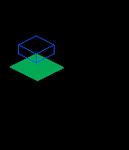

# PGE Isometric Documentation

Direct inclusion of the [`isometric`](https://github.com/C-D-Lewis/isometric)
library for easy inclusion in games.

1. Include the header file:
        
        #include "pge/modules/pge_isometric.h"

2. When drawing with a `GContext` object, perform isometric drawing:

        static void layer_update_proc(Layer *layer, GContext *ctx) {
          // Grab the frame buffer for rendering
          pge_isometric_begin(ctx);

          // Draw some stuff
          pge_isometric_set_projection_offset(GPoint(20, 20));
          pge_isometric_fill_rect(Vec3(20, 20, 0), GSize(30, 30), GColorJaegerGreen);
          pge_isometric_draw_box(Vec3(10, 10, 0), GSize(20, 20), 10, GColorBlueMoon);

          // Release frame buffer before any stock `Graphics Context` drawing
          pge_isometric_finish(ctx);
        }