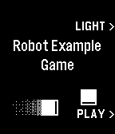

# PGE Title Documentation

## Showing a Title Screen

Using `pge_title.h` allows easy creation of a simple game title screen. It is
assumed that the title screen will be the first thing the user sees, and so at
the bottom of the Window stack. 

The default button configuration assigns the UP button to toggling the backlight
permanently on or off for the life of the app. Thus, developers should choose
the SELECT and DOWN buttons to start their game and perform one additional
action.

> Example title screen.

1. Include the header file:

        #include "pge/modules/pge_title.h"

2. Push the title screen window in your app initialization to show it first.
   Provide a title, text for the SELECT and DOWN actions, the colour of the
   text, the resource ID of the background image (144 x 168) and a
   PGEClickHandler implementation to handle clicks on the title screen:

        void pge_init(void) {
          pge_title_push("Robot Example Game", "", "PLAY >", GColorWhite, RESOURCE_ID_TITLE_BG, title_click);
        }

3. In your title's PGEClickHandler, call `pge_begin()` to launch the main game loop.

        static void title_click(int button_id) {
          if(button_id == BUTTON_ID_SELECT) {
            pge_begin(GColorBlack, logic, draw, click);
          }
        }

4. When your app exits, pop the last window:

        void pge_deinit(void) {
          pge_title_pop();
        }