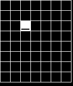

# grid_example

Example game built with PGE that uses the grid library add-on to manage the
movement of a sprite inside a grid, drawn on the screen.

> Example grid game

To move the robot sprite, use UP and DOWN to rotate and SELECT to advance one
grid tile.